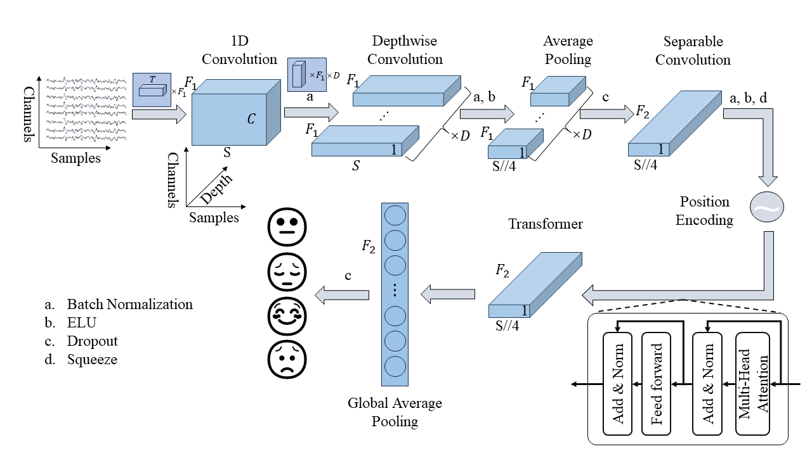

# File Tree:
|-  README.md  
|-  requirements.txt  
|-  logs  # Path: store logs  
|-  data_processed  # Path: store processed data  
|-  model  # Path: store  trained model  
|-  picture  # Path: store pictures in 10-fold cross validation  
|-  utils  # Path: store evaluate tools  
|   |-  visualize.py  # File: visualize the signals  
|   |-  evaluate.py  # File: evaluate the model contains accuracy, precision, recall, f1-score, confusion matrix, ROC curves  
|-  bayesian_optimizier.py  # File: bayesian optimization for finding best hyperparameters  
|-  train_within_*.py  # File: train model within 10-fold cross validation  
|-  transformer.py  # File: model's code  

  
  If you want to run the entire project in its entirety, pull and then add the previously mentioned folders and the processed data.
  model framework:  
  
